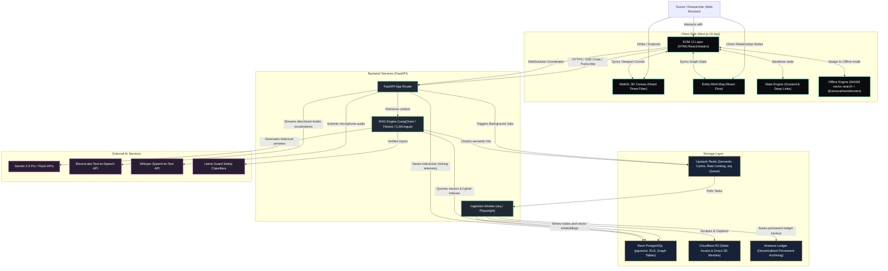

# System Architecture (C4 Model)

Below is the C4 System Context and Container diagram detailing the structure of the Al-Rawi monorepo and its external service integrations.

## Container Diagram

```mermaid
graph TD
    User["Tourist / Researcher (Web Browser)"]
    
    subgraph Client ["Client Side (Next.js 16 App)"]
        UI["DOM UI Layer (HTML/React/shadcn)"]
        WebGL["WebGL 3D Canvas (React Three Fiber)"]
        Flow["Entity Mind Map (React Flow)"]
        Store["State Engine (Zustand & Deep Links)"]
        Offline["Offline Engine (WASM vector search + @xenova/transformers)"]
    end
    
    subgraph Service ["Backend Services (FastAPI)"]
        API["FastAPI App Router"]
        Ingest["Ingestion Worker (arq / Playwright)"]
        RAG["RAG Engine (LangChain / Farasa / LLMLingua)"]
    end

    subgraph Storage ["Storage Layer"]
        DB["Neon PostgreSQL (pgvector, RLS, Graph Tables)"]
        Cache["Upstash Redis (Semantic Cache, Rate Limiting, arq Queue)"]
        R2["Cloudflare R2 (Static Assets & Draco 3D Meshes)"]
        Arweave["Arweave Ledger (Decentralized Permanent Archiving)"]
    end

    subgraph External ["External AI Services"]
        LLM["Gemini 2.5 Pro / Flash APIs"]
        TTS["ElevenLabs Text-to-Speech API"]
        STT["Whisper Speech-to-Text API"]
        Safety["Llama Guard Safety Classifiers"]
    end

    %% Client Interactions
    User -->|Interacts with| UI
    User -->|Orbits / Explores| WebGL
    User -->|Clicks Relationship Nodes| Flow
    
    UI <-->|Syncs Viewport Coords| WebGL
    UI <-->|Syncs Graph State| Flow
    UI <-->|Serializes state| Store
    UI <-->|Swaps to Offline mode| Offline
    
    %% API Communications
    UI -->|HTTPS / SSE Chats / Transcribe| API
    UI -->|WebSockets Coordinates| API
    
    %% Backend Operations
    API -->|Triggers Background Jobs| Cache
    Cache -->|Pulls Tasks| Ingest
    API -->|Retrieves context| RAG
    
    %% Ingestion Actions
    Ingest -->|Scrapes & Captions| R2
    Ingest -->|Saves permanent ledger backup| Arweave
    Ingest -->|Writes nodes and vector embeddings| DB
    
    %% RAG Actions
    RAG -->|Queries vectors & hybrid indexes| DB
    RAG -->|Checks semantic hits| Cache
    RAG -->|Verifies inputs| Safety
    RAG -->|Generates historical answers| LLM
    
    %% Media & Voice Interfaces
    API -->|Streams diacritized Arabic vocalizations| TTS
    API -->|Submits microphone audio| STT
    API -->|Saves interactive clicking telemetry| DB
    
    classDef client fill:#0B0C10,stroke:#66FCF1,stroke-width:2px,color:#FFFFFF;
    classDef api fill:#1F2833,stroke:#45A29E,stroke-width:2px,color:#FFFFFF;
    classDef storage fill:#152238,stroke:#C5A059,stroke-width:2px,color:#FFFFFF;
    classDef external fill:#281E33,stroke:#A2459E,stroke-width:2px,color:#FFFFFF;
    
    class UI,WebGL,Flow,Store,Offline client;
    class API,Ingest,RAG api;
    class DB,Cache,R2,Arweave storage;
    class LLM,TTS,STT,Safety external;
```
